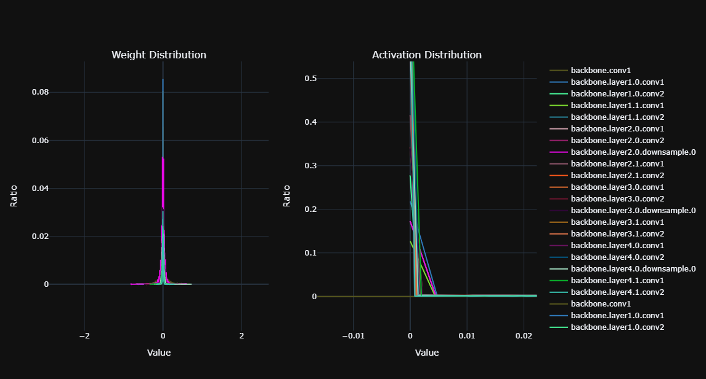

### Installation 

```shell
cd ModelAnalysisTools
python3 setup.py install # or pip3 install -v -e . 
```

### Verifiaction
```shell
>>>python
>>>from analysistools import ModelAnalyticalTool
>>>
```

### How to use the analysis tools


There provides three model analysis tools firstly, and we provide a demo to illustrate the usage of the model analysis tools, please see details in ```one_model_analysis_tool.py```


As shown below, ```one_model_analysis_tool.py``` can analyses the distribution of weights and actications (if you input an image). 

